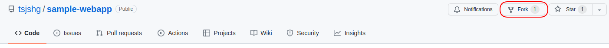

# Herokuへのデプロイ方法

## 事前準備

次の事前準備を実施します。

- Herokuユーザを作成
    - https://signup.heroku.com/signup/dc
- Heroku CLIのインストール
    - https://devcenter.heroku.com/articles/getting-started-with-python#set-up
- Gitのインストール
- GitHubのアカウント

## リポジトリのfork/clone

[サンプルコードのリポジトリ](https://github.com/tsjshg/sample-webapp) にアクセスし、forkをクリックします。



リポジトリをforkすると、自分のGitHubアカウントにリポジトリが作成されます。次のコマンドを実行して、ローカルPCにcloneします。

```bash
git clone https://github.com/<GitHubのアカウント名>/sample-webapp.git
```

または

```bash
git clone git@github.com:<GitHubのアカウント名>/sample-webapp.git
```

## CSSのダウンロード

次のコマンドでHonokaのCSSをダウンロードし、展開します。

Linuxの場合:

```bash
cd sample-webapp
wget https://github.com/windyakin/Honoka/releases/download/v4.4.1/bootstrap-honoka-4.4.1-dist.zip
unzip bootstrap-honoka-4.4.1-dist.zip
rm bootstrap-honoka-4.4.1-dist.zip
```

Windowsの場合:

```bash
cd sample-webapp
Invoke-WebRequest -Uri https://github.com/windyakin/Honoka/releases/download/v4.4.1/bootstrap-honoka-4.4.1-dist.zip -OutFile bootstrap-honoka-4.4.1-dist.zip
Expand-Archive bootstrap-honoka-4.4.1-dist.zip -DestinationPath .
rm bootstrap-honoka-4.4.1-dist.zip
```

## Herokuアプリケーションの作成

次のコマンドを実行し、 `heroku: Press any key to open up the browser to login or q to exit:` と表示されたら任意のキーを入力するとブラウザが起動します。ブラウザからHerokuにログインすると、Heroku CLIが実行できるようになります。

```bash
heroku login
```

次のコマンドを実行して、アプリケーションを作成します。 `<アプリケーション名>` は任意のアプリケーション名を入力します。Herokuですでに利用されている名前は利用できません。

```bash
heroku create <アプリケーション名>
```

リポジトリに `Procfile` というファイル名のファイルを作成し、次の内容を記述します。

```
web: python app.py
```

## Herokuアプリケーションのデプロイ

次のコマンドを実行し、変更をコミットします。

```bash
git add -f Procfile honoka
git commit -m "first commit"
```

次のコマンドを実行し、Herokuにアプリケーションをデプロイします。

```bash
git push heroku main
```

`https://<アプリケーション名>.herokuapp.com/` にアクセスすると、アプリケーションが利用できます。